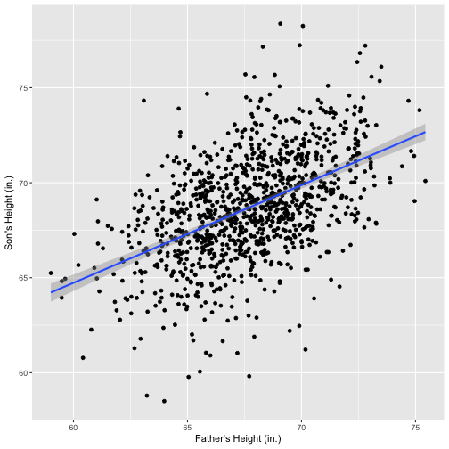
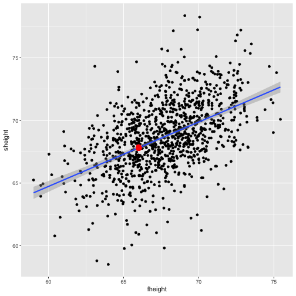

Pitching a Simple App to Explore Pearson's Father-Son Data
========================================================
author: BWH
date: 10/1/2017
autosize: true

Who is Karl Pearson?
========================================================

- 19th century statistician
- Examined 1078 father-son pairs, examining the height of the son
- Coined the idea of 'regression to the mean'
- Also, unfortunately, willing to use research to further eugenics

- [Wikpedia link](https://en.wikipedia.org/wiki/Karl_Pearson)

Why his data?
========================================================

- His dataset is included in the `UsingR` package.
- It is relatively simple -- only two rows `fheight` and `sheight`
- This makes it very usable for demonstrating simple linear regression.

Exploring the Data
========================================================

Plot of Pearson's Data

The App
========================================================

The web application lets users select a height and then show the prediction with
confidence intervals for the fitted linear model. This is a relatable, and hopefully straightforward, example of how linear models work, without many complicating factors (i.e. confounders, related factors).

The app displays the text for the confidence intervals and marks the predicted fit on the plot so that the user can visually see what a prediction using a linear regression model looks like.

